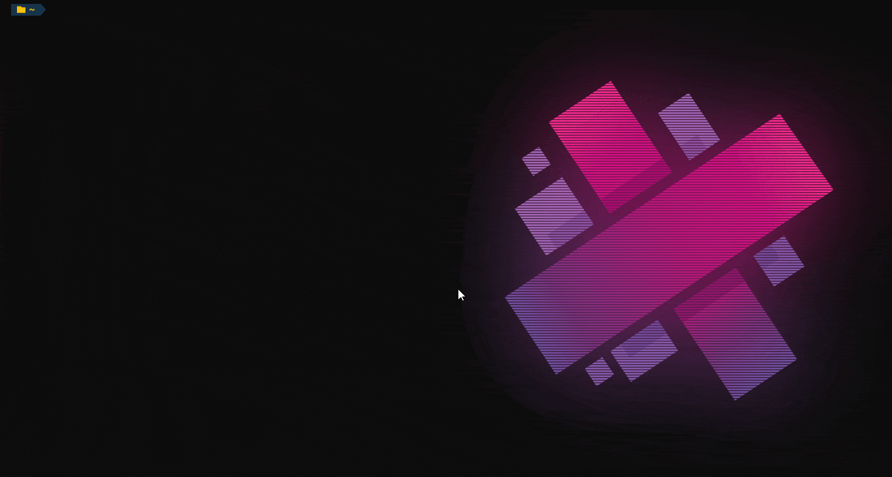
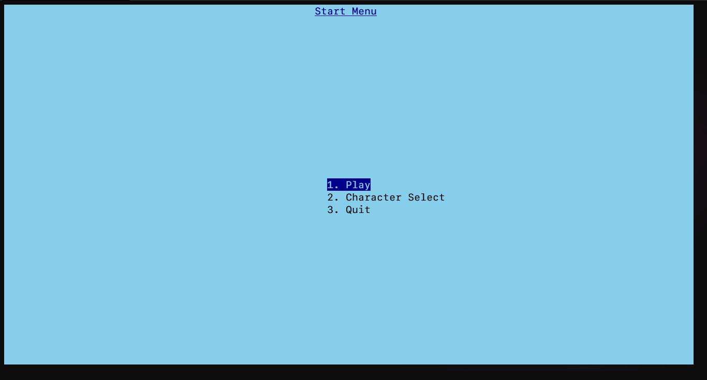
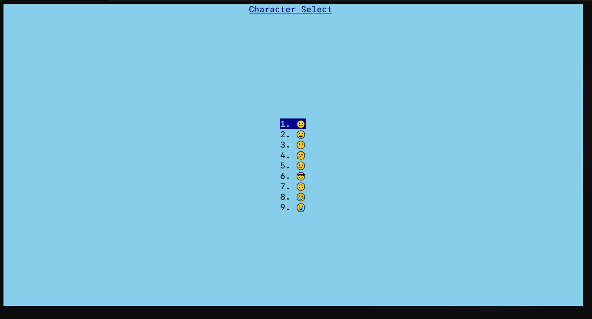
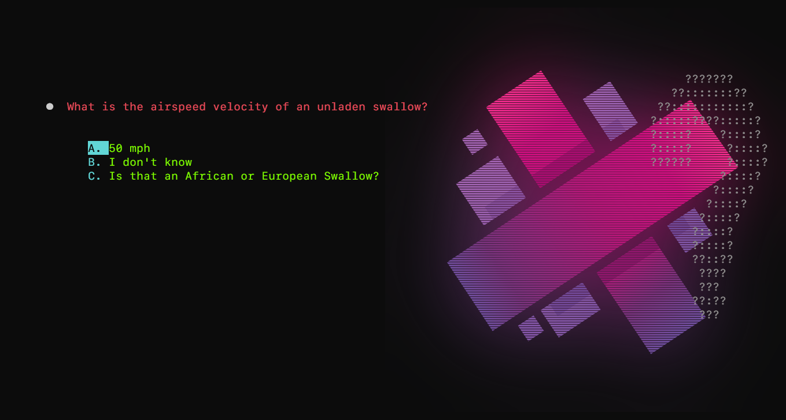

# Think Inside The Box

## Getting started



### Install the Poetry Package Manager

***

To run the game first install the [Poetry package manager](https://python-poetry.org/docs/) to automatically manage dependant packages.

### Clone/Download the repository

***

Clone or [Download](https://github.com/Mature-Magpies/think-inside-the-box/archive/refs/heads/main.zip) this repository and navigate to the it's root directory to install the game's dependant packages with poetry with the following command:

```poetry install```

### Running the game

***

Now you will able to start the game by using the following command:

```poetry run python main.py```

**Note for Windows users:**
*Command Prompt does not render the game properly, please use PowerShell or similar Command Line Interface instead*

## Application Overview

### Start Menu

***



#### Menu Interaction

You can interact with the menu options by either entering the **menu number** or use the **Arrow/WASD keys** to move the highlighted selector and press enter to select.

The Start Menu is the first screen in the game, It gives three options:

#### 1. Play Option

This option allows you to play, if you don’t [select a character](#2-character-select-option) it will use the default which is 🙂.

#### 2. Character Select Option

This option brings you into another menu to choose a character from a list of 9 emojis:



After you enter a choice it will return you to the main menu to allow you to play with the selected character.

#### 3. Quit Option

This option will quit the game.

**Note:** *You can also use the Ctrl+C shortcut to exit the game at any point.*

### Game World

***


The game world is a maze built procedurally each time the game is run by tessellating prebuilt rooms. The player must make their way from the top room of the maze to the bottom; navigating the rooms and interacting with the Non-Player Characters (NPCs).

#### Room Navigation

Rooms are made up of 11 by 11 tiles. These tiles can be one of 3 things: A space ``(displayed as '  ' in a room)``, a wall ``('##')`` or a door ``('//')``.
Spaces and doors act in a similar manner; they allow entities to pass through/over them.
Walls prevent players and NPCs from moving over them.
To enter an adjacent room, the player must land on a door at one of the edges of a room.
Rooms can be navigated using the **Arrow Keys (Up, Down, Left and Right)**.

#### NPC Interaction

To interact with an NPC use the Tab key. This will open the [question screen](#question-screen).

### Question Screen

***



During an encounter with an NPC, you will be presented with a randomly selected question. \
Use the **Arrow Keys (Up and Down)** to select your answer and press **Enter** to confirm. \
If you answered correctly, congratulations! The NPC will move out of the way to let you progress in the [overworld](#Game-World). \
However, if your answer is incorrect, you will be sent back to the beginning of the dungeon!

## Altering Game Files

### Adding or Changing Room Layouts

***

Additional Room layouts can be added by editing the room_templates.json file located in the src/GameObjects directory.

Room layouts are organised into 5 main categories:

1. dead-end: Room has only one entrance and exit.
2. straight: Room has two exits - each at opposite edges of the room.
3. corner: Room has two exits - exits are adjacent to one another.
4. 3-way-junction: Room has 3 exits.
5. 4-way-junction: Room has 4 exits.

Style guide: Room entrances follow a standard layout of priority for their entrances:

- The use of non-aesthetic doors must correspond to the category in which the room was placed.
- First entrance without a entrance adjacent anticlockwise is placed at the top.
- All subsequent entrances are then placed around the sides in a clockwise fashion. *Exceptions to this rule are*:
  - straight: entrances are opposite and therefore fully reversible.
  - 4-way-junction: has all 4 entrances and therefore no default orientation.

While doors can be placed on any space in the grid, it is recommended that non-aesthetic doors along the edges of rooms remain centred (for consistency).

Rooms are stored in the following format:

```json
{
    "name":"room_name",
    "Layout": ["<2D array of 11×11 size>"]
}
```

For playability, corridors along the edges of rooms must have double-space width to prevent NPC characters from blocking the way.
In addition, entrances must have an empty space of at least 3×2 in front (to prevent edge cases where after entering, the player gets trapped in a corner by the NPC)

### Adding or Changing Questions

***

Additional Questions can be added by editing the `questions.json` file located in the *src/res* directory.

Each question is represented as a dictionary with the following keys:
 - `id`: A unique string to identify the question within the engine (for example, we can filter out math questions by looking for the 'math-' prefix in their ID.)
 - `prompt`: The question's prompt, i.e. the question that the player will have to answer.
 - `choices`: A list of possible options. Technically, you could add up to 26 different options (one for each letter in the alphabet).
 - `correct`: The index of the correct answer in the choices list, starting at 0.

```json
{
    "id": "readme-demo",
    "prompt": "Did you understand how questions work?",
    "choices": [
      "No",
      "Yes",
      "Perhaps"
    ],
    "correct": 1
}
```

### Changing Object Representation

***

The game can be 're-skinned' through the editing of the object_representation.json in the src/GameObjects directory. All but the player character can be re-skinned (the player can now be customised through the in-game menu at the start of the game).
All objects must have a width of two unicode characters.
The door object has two states: unlocked and locked, hence it has two representations in the json file - unlocked first, locked second.
NPC character representations are randomly selected at initialisation from the NPC array.
